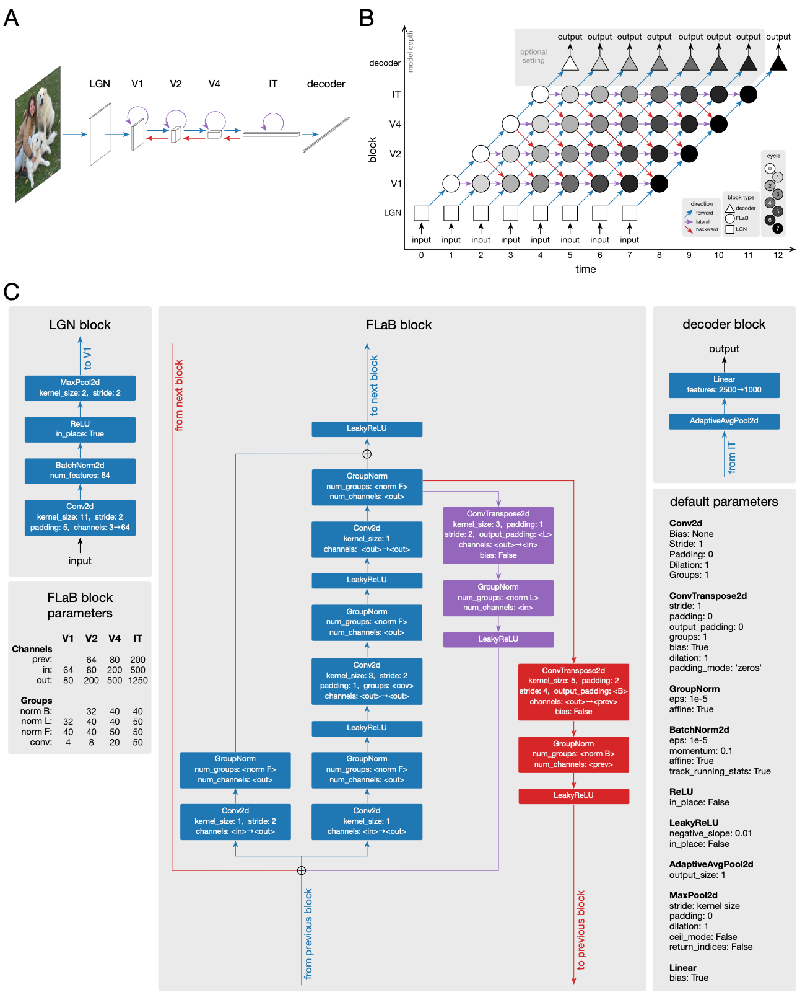

# FLaBnet

This repository contains FLaBnet, a recurrent convolutional neural network 
(R-CNN) designed to mimic the open-ended recurrence between different 
regions of the ventral visual pathway in the human brain. FLaBnet contains 
feedForward, Lateral, and feedBack connections, and can be fed with either 
image or video inputs. The architecture was inspired by CORnet-S from 
Kubilius et al., 2018, but with several important modifications to improve 
performance and allow for open-ended recurrent processing. For instance, 
squeeze-excitation blocks were incorporated following Hu et al., 2018.

## Features
- **Open-ended recurrent processing**: FLaBnet can receive changing inputs 
  and produce changing outputs over time, allowing it to process videos or 
  revise its predictions over multiple processing cycles for static images. 
  FLaBnet can also be evaluated using an arbitrary number of processing 
  cycles, irrespective of the number of cycles used during training. This is
  due to the use of GroupNorm rather than BatchNorm in the recurrent blocks, 
  as BatchNorm requires separate normalization parameters to be learned for 
  each recurrent cycle in order to function.

- **Direct mapping between FLaBnet architecture and different regions of the 
  human visual system**: Each block in FLaBnet corresponds to a different 
  brain region, starting from LGN and ending at IT, allowing for direct 
  comparisons between model activity and neural data from different brain areas.

Below is a figure illustrating the FLaBnet architecture:

(A) Coarse architecture of FLaBnet, showing the five main blocks prior to 
the decoder and the connections between them. (B) Illustration of the open-
ended recurrence and information flow across processing cycles / time steps. 
(C) Detailed break down of the architecture for each block type, 
annotated with the PyTorch modules used and their parameters.